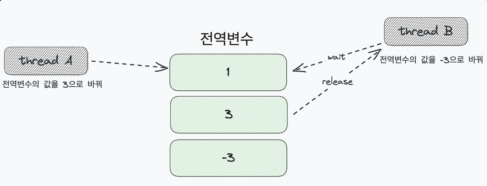

## 임계영역

스핀락을 이해하기 위한 선수지식으로는 경쟁상태, 임계 영역에 대해 선수로 알아야한다. 이미 우리 팀 다른 크루들이 경쟁상태, 임계영역에 대해 잘 다루었으니 간단히만 설명하고 넘어가도록 한다.

임계영역이란 여러 쓰레드 또는 프로세스가 공유 자원에 접근할 수 있는 코드 영역을 뜻한다. 즉, 코드 상에서 경쟁 상태가 발생할 수 있는 곳으로, 둘 이상의 쓰레드가 동시에 접근하면 안되는 구역이다.

임계 영역에서 발생하는 경쟁상태를 방지하기 위해, 우리는 다양한 동기화 기법을 사용할 수 있다.

## Lock(락, 잠금)

락(Lock) 이란 공유 자원을 특정 쓰레드가 사용하고 있을 때, 다른 쓰레드는 해당 공유 자원에 접근할 수 없도록 제한하는 것이다.

위의 경우, 쓰레드 A가 접근하면 공유 자원에 락을 걸어 B가 접근하지 못한다. A 는 작업이 종료되면 락을 풀고(unlock), 대기(wait) 중이던 쓰레드 B 가 작업을 수행하게 만든다.

이렇게 스레드를 순차적으로 실행하게 만들면 공유 자원의 동기화를 구현할 수 있다. 여기에 사용되는 Lock의 종류 중 하나가 바로 오늘의 주제인 Spinlock 이다.

## 스핀 락

스핀락이란 쓰레드가 락을 얻을 때 까지 무한 루프를 돌며 확인하는 동기화 락 메커니즘이다. 일련의 동기화 과정을 간단히 설명하자면, 먼저 쓰레드가 실행되는 동안 (= CPU 자원을 점유하는 동안) 공유 자원에 락을 걸고, 쓰레드 작업이 종료되면 락읋 해제한다. 따라서 다음 쓰레드가 CPU 를 차지하기 위해선 공유 자원에 락이 걸렸는지 안걸렸는를 파악하는 과정이 필요하다.

스핀락은 대기중인 쓰레드가 공유 자원의 상태를 무한 루프를 이용해 
확인하는 방식이다. 락이 걸려있으면 작업을 수행하지 못하고, 락이 걸려있지 않다면 작업을 할 수 있으니, 그냥 무작정 반복적으로 Lock 이 반환될 때 까지 확인하며 대기하는 것이다.

이러한 스핀락은 OS 의 스캐쥴링 자원을 받지 않기에, 해당 쓰레드에 대한 Context Switching 이 일어나지 않는다는 특징이 있다.

### 장점

스핀락은 쓰레드가 대기 상태로 전횐되지 않기 때문에 문맥 교환이 일어나지 않는다고 했다. 따라서 다음의 장점을 갖는다.

- 문맥 교환에 핋요한 CPU 의 오버헤드를 줄일 수 있다.
- 락의 획득이 빠르다.

### 단점

- busy waiting : 스핀락을 획득하기 위해 CPU 오버헤드가 발생할 수 있다.
- starvation (기아 상태) : 특정 쓰레드나 프로세스가 공유 자원을 오랫동안 점유한다면, 다른 쓰레드들이 대기 상태에 갇힐 수 있다.

## 스핀락은 언제 적용할까?

스핀락은 임계구역에서의 작업이 빠르게 이루어질 때 매우 유용하다. 또한 스핀락의 무한 루프 덕분에 락의 획득과 반환이 빨라 실행 속도도 빨라지고, 문맥 교환이 생략되기에 CPU 의 오버헤드도 줄어든다.

그리고 스핀락은 여러 개의 CPU 코어가 존재할 때 유용하다. 사용하지 않는 CPU 코어에서 스핀락을 통해 대기하다가 바로 락을 획득할 수 있기 떄문이다. (사실 단일 코어일 땐 스핀락이 의미가 없기도 하고.) 따라서 트레이드 오프를 고려하여, 경합 상황이 길거나 싱글 CPU일 경우엔 다른 동기화 메커니즘 (ex. 뮤텍스, 세마포어 등)을 고려해보자.